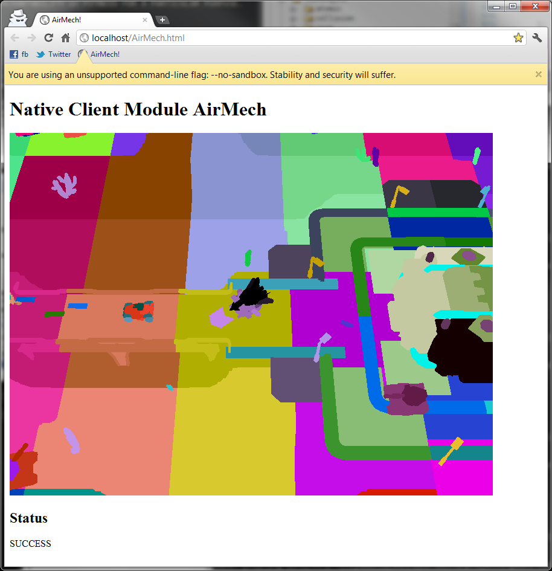
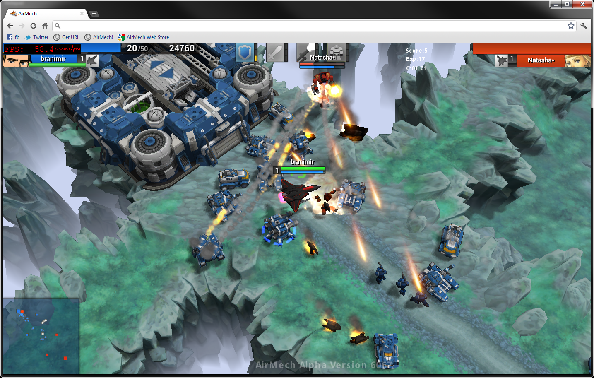

This article was originally published at Carbon Games blog [here](https://web.archive.org/web/20120121053957/http://carbongames.com/2012/01/Native-Client#disqus_thread).

This article is provided for archival purposes only. The technology discussed herein is obsolete.

## Introduction

We haven’t posted in a while here, sorry, but we are busy working on the game and porting it to Native Client. Since the beginning we had the intention to make AirMech available on all platforms that our players are running. Early in our PC alpha we had a lot of requests for Linux and a Mac port and we were planning to do native ports, when Native Client support was made available for the Chrome web browser, we decided to give it a try. This blog post is short description of the process of porting our game to support Native Client.

## What is Native Client?

[Native Client](https://en.wikipedia.org/wiki/Google_Native_Client), often called simply NaCl, is a plugin technology that runs inside Chrome browser, and hopefully in the future, all browsers. It enables applications written in C/C++ to run natively inside a secure sandbox. This sandbox is there to protect users from malicious or buggy applications. In a sense it’s similar to ActiveX, but other than native execution, other similarities don’t exist. Actually with the amount security concerns put into the whole Native Client, it’s not even fair to compare it to ActiveX technology.

Someone might ask ‘why does native executable matters for games in browser?’ Because speed of execution matters, and JavaScript’s abstraction penalty is too high. I know there will be people trying to argue that JavaScript is as fast or approaching speeds of native execution, but seriously, my answer to those people is prove it! Also, please don’t use some WebGL example where JavaScript renders a quad across the screen and most of the work is done in the fragment shader.

## Toolchain and SDK

We anticipated that we would port our game to other platforms and the first step to porting is to add at least one more compiler into the mix. Almost all non-Microsoft platforms are using GCC or compiler that’s compatible with GCC. So I got AirMech code base compiling with MinGW on Windows early on. [Premake](https://web.archive.org/web/20120119020903/http://carbongames.com/2011/08/Premake/) makes adding different GCC (I call it GCC ‘flavors’) toolchains trivial. But to port our game to NaCl we had to remove our dependency on a closed-source physics library that didn’t support NaCl and to switch to an [open source](http://localhost:1313/posts/open-source-or-it-didnt-happen/) physics library. After that getting the game to compile and link with NaCl toolchain was matter of #ifdef-ing our Windows specific code.

I haven’t really found any limitations in comparison with our native build. For some reason I expected that assembly won’t be accessible, but actually you can write assembly without any problems. This might be handy if you have profiling code depending on RDTSC and CPUID instructions or some other optimized code that depends on the SSE instruction set. SSE intrinsics can be enabled with -msseX compiler option where X is SSE version. All of this might break in the future once more CPUs are targeted with NaCl, but for now it just works.

All access to input, sound, graphics, etc. is done thru Pepper API (PPAPI). The SDK offers both C and C++ API. Since we have exceptions and RTTI off for the whole project I couldn’t use C++ PPAPI, but I also I found that it’s easier to deal with C PPAPI.

The Toolchain comes with standard GDB debugger. I find GDB debugger to be more of a deterrence strategy debugger, because when only GDB is available, the programmer is just more careful while coding so that use of GDB is not necessary. When I had problems with NaCl module I did all debugging with printfs. Printf is just the most versatile, feature complete, cross platform debugger.

## Sandbox

To run an executable you have to run a local web server. My choice was Nginx, since it’s pretty easy to setup. Mongoose would be even easier, I just didn’t know about it at the time. This was also the first speed bump I encounter. I had to get adjusted to the fact that NaCl executable has all the restrictions any regular web page would have. You can’t access the file system, open files, read/write them, etc., you have to fetch them with an HTTP request from the remote website. All file access is abstracted and we were using packages on Windows anyway. I just added memory file access, that behaves like regular file access, but everything is stored in memory. Another issue was that there is no regular main entry point, actually there is but it’s reserved for the Pepper API. The regular NaCl module starts with a callback that Chrome makes to Pepper. The simplest thing to do is just to call pthread_create and inside thread function call, just call your main. This actually helps in general because the main thread cannot be blocked by game loop. Also most of the calls to Pepper are completely asynchronous, and you have to wait for completion callback which is called on main thread.

Sometimes the sandbox gets in the way, for example for our network debugging we’re using journaling technique. Journaling produces a lot of data that we dump on disc. Rate is around 1GB per 5 minutes of game play, but without direct access to disk we don’t have good way to write it. I still haven’t solved this problem, but probably what I’m going to do is to add server that would just dump everything sent thru WebSocket to disk.

## Rendering

Our renderer was Direct3D based, which makes sense for Windows but we had to port it to OpenGL. Now there is longer story about our renderer, which was originally OpenGL based, written by Ken a long time ago, and morphed into Direct3D. In general it looked like and behaved like OpenGL but it was crusty and hard to extend. I decided that it’s time for fresh start and in order to implement the features we need we needed fresh start. NaCl like WebGL is using OpenGL ES 2.0 which is actually a pretty decent subset of OpenGL. I would call it OpenGL Lite. It’s definitely missing some nice to have features from Direct3D, but in general OpenGL was extension mess for such a long time that OpenGL ES 2.0 feels like fresh start and another chance for OpenGL.

Below is the first screenshot of our OpenGL ES renderer. It’s not pretty but it was exciting to see our game run in the browser for the first time!

The only issue I noticed with rendering inside NaCl is that there is an extra frame(s) latency. It seems to vary between 2-3 extra frames. This is due that GPU calls are submitted from a completely different process and that all has to be communicated thru RPCs. Because of this any OpenGL call that depends on GPU result are very expensive. Calling glFinish or glGetError will cause your game to block until GPU catches up. This latency is not huge a issue for AirMech, but this might be an issue for those who are making twitch game and where a split second makes huge difference. The only thing we had to do so far is disable rendering of in game mouse. This will probably dictate what kind of games we’ll see on NaCl.

Also graphics is the only place where you might experience cross platform issues, so you have to test it on all platforms. So far we found only one fragment shader bug on Mac that doesn’t appear on Linux or Windows with casting matrix types mat4 into mat2.

Chrome support for GPUs on different platforms varies and it’s due to driver support. For example some GPUs that work well under Windows with Chrome are blacklisted by Chrome on Linux. We don’t have a good way to detect this, and if player decided to ‘un-blacklist’ GPU, the game might just crash or not render graphics. But that’s a known issue and hopefuly drivers for GPUs on Linux will improve over time and Chrome will remove certain GPUs from their blacklist. Depending on the number of players having issues like this we might consider having really simple shaders that would work even on those blacklisted drivers, but that would have visual impact on the look of the game.

For a while we had two renderers in the code base and only recently we made complete switch to the new renderer. Now we support both Direct3D 9 and OpenGL ES 2.0. These standards are close in feature set and they cover wide variety of platforms, from smartphones and tablets to current generation of consoles.
Networking

NaCl doesn’t support networking natively yet. All network traffic has to go thru JavaScript and use WebSocket. To send data between a NaCl module and JavaScript it must be UTF8 encoded string, therefore the stream can’t be binary. Our network stream is Base64 encoded, which produces 1/3 more data (24 bits are encoded into 32 bits) than regular binary TCP stream. There is also additional latency added in this communication between NaCl module and JavaScript, and we’re seeing slightly higher round trip times over our native version. We’re doing all our network testing on remote servers located in California and this additional latency didn’t affect the game play in comparison with our native version.

Since [our existing network library uses TCP](http://github.com/bkaradzic/bnet), I just implemented standard BSD socket functions socket, connect, send, recv, select, etc. that behave exactly like standard TCP socket but do work of encoding/decoding stream between the NaCl module and JavaScript. That way there are no changes in how our game communicates with the remote host and it’s all compatible with our existing code. If this sounds complicated, you should not worry because NaCl is getting native support for WebSockets in one of upcoming releases and all this won’t be necessary anymore. You’ll be able to directly connect to WebSocket without going thru JavaScript. Hopefully this will reduce latency we were seeing. You can take a look at an early version of the upcoming PPAPI WebSocket interface here: C API and C++ API.

On the backend we’re using the Go language, and adding WebSocket to our existing game session server was literally 10 lines of code. A few lines of code to get WebSocket handler function and a few to add Base64 encoder/decoder to the socket stream.
Conclusion

Overall our experience with Native Client is positive. It’s great that finally we can write C/C++ code and execute it in the browser! I’ve been watching this project since it was announced by Google a few years ago. At the time they announced it I expected to see it integrated into browsers quickly but it seems the Native Client went thru very slow process to get to the hands of users. Also there are other benefits of mixing native code with web technologies. Features that would be hard to implement in a regular game that runs natively outside the browser become almost trivial to implement with NaCl. For example if you want to make a only browser game, you can go crazy with integrating web features into your game. One thing immediately comes to mind is integrating YouTube videos, or social features into the game. All this doesn’t even have to be inside NaCl module, it can be just communicated thru JavaScript and displayed as an overlay on the top of NaCl module.

AirMech will be available in the ChromeWeb Store later this year. Right now we’re in still in an alpha development phase. If you would like to check our the AirMech alpha build or how Native Client works for you, you can join AirMech Alpha Google Group and we’ll give access to our latest build of AirMech running on Native Client.

## Resources

Information about developing for NaCl is a bit scarce right now, but I hope this blog post will be useful if you’re thinking or trying to port your code base to NaCl. If you feel you would like to try to build your application or game for NaCl, these are good starting points for more information about NaCl development:

 - Official Native Client Developer site  
   https://web.archive.org/web/20120121053957/https://developers.google.com/native-client/

 - The Workbench  
   https://web.archive.org/web/20120121053957/http://mainroach.blogspot.com/

 - Notes on Native Client & Pepper Plugin API  
   https://web.archive.org/web/20120121053957/http://aras-p.info/blog/2011/06/02/notes-on-native-client-pepper-plugin-api/

 - Native Client For Dummies  
   https://web.archive.org/web/20120121053957/http://altdevblogaday.com/2011/10/26/native-client-for-dummies/

 - GameDevBlog  
   https://web.archive.org/web/20120121053957/http://www.gamedevblog.com/
