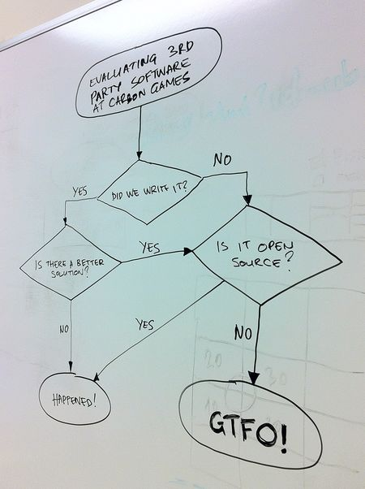

This article was originally published at Carbon Games blog [here](https://web.archive.org/web/20120131160725/http://www.carbongames.com/2011/09/Open-Source/).

One of the most common questions people are asking us is what engine/tech we’re using for AirMech. Well, yesterday we nuked last closed source library from our code base and as of today all the code we’re using is custom in-house or open source. We now have a complete list of [open source](https://web.archive.org/web/20120131160725/http://www.carbongames.com/opensource.html) software we’re using for our game development. This list is complete for all software we’re using on the client. We’ll also update it with open source software that we’re using in code we’re not distributing: for development, game servers, web, etc. Without listing all this we might not realize how much we rely on open source. This project wouldn’t be happening if it wasn’t for this open source or at least our progress wouldn’t be as rapid as it is.

We are not against licensing or using proprietary middleware, but so far on every step it showed to be an obstacle. An obstacle in terms of lock-in onto specific platforms, or if a middleware vendor is not interested to support some platforms we are considering, or just requiring signing complex agreements. To us as an indie developer, freedom to pick any platform we want and port our code base to, is really important. Other benefits of not having middleware is that we don’t have to annoy players with splash screens which are often required by middleware providers. We want players to get into the game as quick as possible, without waiting and staring at product or company logo for some time limit defined in some licensing agreement.

Based on questions we are asked I’m under the impression that, for some reason nowadays, people think that is impossible to make a video game without using some commercial middleware. Yes there are great products that enable a lot of creative people to make games without investing too much time into technology. But there is also a lot of great open source software that can be used to build games. We are also old school, and we come with a lot of background in building engines and tech for games. Also we’re living in the time when game development has never been easier. Graphics hardware is matured, there are no huge changes, or at least for the target market we’re targeting there are no huge changes. In the 90ies supporting whole range of hardware was such a mess: many manufacturers, many standards, some complete crap graphics cards and you have to write software rasterizer for players without graphics cards. Nowadays there are only a few GPU manufactures and not many graphics standards. There are still issues with players have really old hardware, and there are still graphics cards that can’t even run DX9, but we set our minimum specification to DX9 class GPU and we’re going to optimize for it.

Just because it’s open source doesn’t mean it’s good by default. When choosing an open source library, we have a few considerations. We avoid bloated libraries that are trying to do everything. Ideally library is only doing one thing and it’s doing it really well. It’s easy to integrate and maintain. Also even thought we’re using C++, we find it easier to adopt a library written in C than in C++. Usually C++ libraries tend to be more complex than their C counterparts. This complexity usually comes from requirement to include other libraries or just from the feature set. Often C++ libraries look like someone was trying to impress the C++ committee with their metaprogramming cleverness than to create something useful for other C++ programmers to use. When we choose a C++ library, the library cannot require the use of exceptions or RTTI functionality of C++ language, since these are always disabled in all our builds.

Just as a simple example of how this theory and flow chart above works; if we were looking for a json library for the client it would be to very lite and know only how to write and how to parse valid json. We don’t need validation, since all json files will come from trusted source which are package files or our backend. And on the backend we’re using more robust json library that supports validation of data that’s coming from client. If offered choice between [JSON_Spirit](https://web.archive.org/web/20120131160725/http://www.codeproject.com/KB/recipes/JSON_Spirit.aspx) and [js0n](https://web.archive.org/web/20120131160725/https://github.com/quartzjer/js0n/blob/master/js0n.c) we would pick js0n. js0n satisfies most of our client requirements, it doesn’t require extra libraries, it’s easy to integrate, and we would only need to write json writer. Simple always wins!

So what about us? We have the intention to at some point in the future release some parts of our code base as open source. We don’t think releasing the whole code base makes sense, since it would be very hard for someone to adopt it. Our intention is to release independent parts that would be easy for other developers and hobbyist to adopt. Ideally we would do this under [BSD 2 clause license](https://en.wikipedia.org/wiki/BSD_licenses#2-clause_license_.28.22Simplified_BSD_License.22_or_.22FreeBSD_License.22.29) or similar liberal license.

Fun facts: This blog post is written in **VIM**, and if it wasn’t written by me it would be most likely written in **Notepad++**, checked in into **Git**, then this site is generated by **Jekyll**, pushed from **Debian** with **rsync** to server that runs **CentOS** and **Apache** web server. And now you’re viewing it with **Firefox**, **Chrome** or some other **WebKit** based browser.
