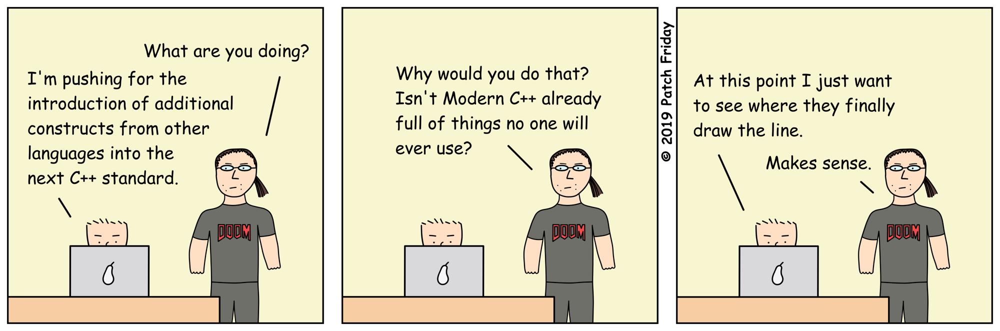

This article was originally published as a gist [here](https://gist.github.com/bkaradzic/2e39896bc7d8c34e042b).

## What is Orthodox C++?

Orthodox C++ (sometimes referred as **C+**) is minimal subset of C++ that improves C, but avoids all unnecessary things from so called Modern C++. It's exactly opposite of what [Modern C++](https://stackoverflow.com/questions/3661237/what-is-modern-c) suppose to be.

## Why not Modern C++?

Back in late 1990 we were also modern-at-the-time C++ hipsters, and we used latest features. We told everyone also they should use those features too. Over time we learned it's unnecesary to use some language features just because they are there, or features we used proved to be bad (like RTTI, exceptions, and streams), or it backfired by unnecessary code complexity. If you think this is nonsense, just wait few more years and [you'll hate Modern C++ too](http://archive.md/2016.05.17-214038/https://www.linkedin.com/pulse/why-i-dont-spend-time-modern-c-anymore-henrique-bucher-phd) ("Why I don't spend time with Modern C++ anymore" archived LinkedIn article).

## Why use Orthodox C++?

Code base written with Orthodox C++ limitations will be easer to understand, simpler, and it will build with older compilers. Projects written in Orthodox C++ subset will be more acceptable by other C++ projects because subset used by Orthodox C++ is unlikely to violate adopter's C++ subset preferences.

## Hello World in Orthodox C++

	#include <stdio.h>

	int main()
	{
	    printf("hello, world\n");
	    return 0;
	}

## What should I use?

 - C-like C++ is good start, if code doesn't require more complexity don't add unnecessary C++ complexities. In general case code should be readable to anyone who is familiar with C language.
 - Don't do [this](http://archive.md/2014.04.28-125041/http://www.boost.org/doc/libs/1_55_0/libs/geometry/doc/html/geometry/design.html), the end of "design rationale" in Orthodox C++ should be immedately after "Quite simple, and it is usable. **EOF**".
 - Don't use [exceptions](https://web.archive.org/web/20190116034706/http://www.lighterra.com/papers/exceptionsharmful/).
 
> Exception handling is the only C++ language feature which requires significant support from a complex runtime system, and it's the only C++ feature that has a runtime cost even if you don't use it – sometimes as additional hidden code at every object construction, destruction, and try block entry/exit, and always by limiting what the compiler's optimizer can do, often quite significantly. Yet C++ exception specifications are not enforced at compile time anyway, so you don't even get to know that you didn't forget to handle some error case! And on a stylistic note, the exception style of error handling doesn't mesh very well with the C style of error return codes, which causes a real schism in programming styles because a great deal of C++ code must invariably call down into underlying C libraries.

 - Don't use RTTI.
 - Don't use C++ runtime wrapper for C runtime includes (`<cstdio>`, `<cmath>`, etc.), use C runtime instead (`<stdio.h>`, `<math.h>`, etc.)
 - Don't use stream (`<iostream>`, `<stringstream>`, etc.), use printf style functions instead.
 - Don't use anything from STL that allocates memory, unless you don't care about memory management. See [CppCon 2015: Andrei Alexandrescu "std::allocator Is to Allocation what std::vector Is to Vexation"](https://www.youtube.com/watch?v=LIb3L4vKZ7U) talk, and [Why many AAA gamedev studios opt out of the STL](https://web.archive.org/web/20220227163717/https://threadreaderapp.com/thread/1497768472184430600.html) thread for more info. 
 - Don't use metaprogramming excessively for academic masturbation. Use it in moderation, only where necessary, and where it reduces code complexity.
 - Wary of any features introduced in current standard C++<year>, ideally wait for improvements of those feature in next iteration of standard. Example `constexpr` from C++11 became usable in C++14 ([per Jason Turner](http://archive.md/2018.02.01-171248/https://twitter.com/lefticus/status/958931109009440768) cppbestpractices.com curator)
 - Don't use [modules](https://web.archive.org/web/20251019163438/https://nibblestew.blogspot.com/2025/08/we-need-to-seriously-think-about-what.html).

> Using modules brings with it the following disadvantages:
>
>   1. Need to rewrite (possibly refactor) your code.
>   2. Loss of portability.
>   3. Module binary files (with the exception of MSVC) are not portable so you need to provide header files for libraries in any case.
>   4. The project build setup becomes more complicated.
>   5. Any toolchain version except the newest one does not work (at the time of writing Apple's module support is listed as "partial")
>
> In exchange for all this you, the regular developer-about-town, get the following advantages:
>
>   1. Nothing.

## Is it safe to use any of Modern C++<year> features yet?

Due to lag of adoption of C++ standard by compilers, OS distributions, etc. it's usually not possible to start using new useful language features immediately. General guideline is: if current year is C++_year_+5 then it's safe to start **selectively** using C++_year_'s features. For example, if standard is C++11, and current year >= 2016 then it's probably safe. If standard required to compile your code is C++17 and year is 2016 then obviously you're practicing "Resume Driven Development" methodology. If you're doing this for open source project, then you're not creating something others can use.

## Revision History

**UPDATE** As of January 14th 2025, Orthodox C++ committee approved selective use of C++20.

 - Oct 19, 2025 - [Added info on modules](/posts/orthodoxc++/#:~:text=Don%E2%80%99t%20use%20modules.,Nothing.).
 - Jan 16, 2019 - [Added exception handling](/posts/orthodoxc++/#:~:text=Don%E2%80%99t%20use%20exceptions.,C%20libraries.).
 - Feb  1, 2018 - [Addded info how constexpr needed multiple iterations to be useful](/posts/orthodoxc++/#:~:text=Wary%20of%20any,curator).
 - Jan 16, 2016 - [The original article.](https://gist.github.com/bkaradzic/2e39896bc7d8c34e042b/efe7b7470a488d7752ca28c87146d80d83b3e71b).

## Any other similar ideas?

 - Embedded C++  
   https://en.wikipedia.org/wiki/Embedded_C%2B%2B

 - Nominal C++  
   http://archive.md/2016.08.07-162105/https://namandixit.github.io/blog/nominal-c++/

 - Sane C++  
   http://archive.md/2016.08.07-162220/http://flohofwoe.blogspot.nl/2013/06/sane-c.html

 - Why Your C++ Should Be Simple  
   http://archive.md/2017.03.19-055108/https://hacksoflife.blogspot.nl/2017/03/why-your-c-should-be-simple.html

 - C++, it’s not you. It’s me.  
   https://web.archive.org/web/20190227061553/https://c0de517e.blogspot.com/2019/02/c-its-not-you-its-me.html

 - "Keep It C-mple" Alexander Radchenko Sydney C++ Meetup  
   https://www.youtube.com/watch?v=lTXHOOwfTAo

 - A dialect of C++  
   https://web.archive.org/web/20200521234043/https://satish.net.in/20180302/

 - The Defold engine code style  
   https://web.archive.org/web/20241003193318/https://defold.com/2020/05/31/The-Defold-engine-code-style/

 - Orthodoxy - plugin for the Clang compiler, which selectively disables specific features of the C++ language  
   https://github.com/d-musique/orthodoxy?tab=readme-ov-file#orthodoxy
 
## Code examples

 - Any C source that compiles with C++ compiler.

 - DOOM 3 BFG  
   https://github.com/id-Software/DOOM-3-BFG

 - Qt  
   https://github.com/qtproject) (when built with no-rtti, no-exceptions

 - dear imgui  
   https://github.com/ocornut/imgui

 - bgfx  
   https://github.com/bkaradzic/bgfx

 - TheForge  
   https://github.com/ConfettiFX/The-Forge

 - Oryol  
   https://github.com/floooh/oryol

 - Network Next SDK  
   https://github.com/networknext/sdk
