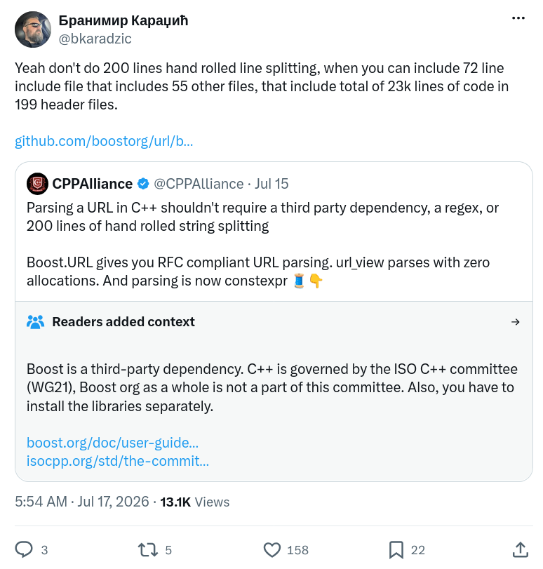

## Introduction

Years ago I started writing a proper shader front-end parser for bgfx and used the [Lemon parser generator](https://sqlite.org/lemon.html).

It was small, it worked, but I never liked the code it produced. The generated output felt hard to read, and the code that generated the parser also felt alien to me. Every time the grammar changed I had to re-learn the shape of the resulting code. It solved the problem, but eventually I abandoned it.

On the other side of the spectrum I kept writing ad-hoc parsers for smaller things where using something like Lemon was overkill. Pointer arithmetic, manual loops over characters, a handful of `strchr/strncmp` style calls, some state variables, and a hope that I hadn’t missed an edge case. These were fast and had no dependencies, but they always ended up repeating the same patterns: skipping whitespace, collecting identifiers, tracking line numbers for error messages, handling the inevitable off-by-one when the input wasn’t perfectly formed. Each new parser became its own little minefield of one-off bugs, and every new thing that needed parsing got its own private copy of them.

Most of this ad-hoc parsing code looked roughly like this:

```cpp
const char* pos = input.getPtr();
const char* end = input.getTerm();

while (pos < end
   &&  bx::isSpace(*pos) )
{
    ++pos;
}

const char* start = pos;
while (pos < end
   && (bx::isAlphaNum(*pos) || *pos == '_') )
{
    ++pos;
}

bx::StringView ident(start, pos);
```

Multiply that pattern by every token type, add manual line counting, add handling for `\r\n` versus `\n`, and you have the classic ad-hoc scanner. It works and it is fast. I’ll leave it to the reader’s imagination how the same logic would look after someone decided it needed to be "modern" and rewrote it with Boost.Spirit.

What I wanted was something in between: a small set of reusable primitives that took care of the repetitive parts of scanning without dragging in a generator or a dependency graph. Zero-copy, allocation-free, and readable in a debugger. That is what [bx::Scanner](https://github.com/bkaradzic/bx/blob/056ea3486cb6aca02f2344111661e4e8f88ebb2c/include/bx/scanner.h#L13-L25) is. It is not a parser generator and not a Parsing Expression Grammars (PEG) library, and it is not trying to become either.

## Design

`bx::Scanner` is built around a small set of deliberate constraints:

- **Zero-copy and non-owning.**
  The scanner never allocates and never copies text. Every result is a `StringView` that points directly into the original input, including the empty ones, which point at the cursor rather than at nothing.

- **One cursor, and it never moves on its own.**
  A single current position. `accept` / `acceptWhile` / `acceptUntil` move it forward. `peek` runs the same test without moving. `seek` and `reset` exist, but nothing backtracks implicitly.

- **Built-in line and column tracking.**
  Any movement across a newline updates the line number, including a backwards `seek`. `getLine` and `getColumn` are always available and both are one-based, which makes decent error messages nearly free.

- **Character classes instead of a mini-language.**
  A handful of classes (`Class::Space`, `Class::NonSpace`, `Class::Identifier`, `Class::EndOfLine`, `Class::NewLine`) cover most everyday scanning. Anything more specific is an ordinary `bool(*)(char)` predicate handed to `accept` / `acceptWhile`. There is no pattern language to learn, and nothing to debug except your own function.

- **Tiny surface area.**
  The whole public interface fits in one small header.

The workflow is always the same: construct a `Scanner` over a `StringView`, then `peek` and `accept` until you are done.

```cpp
bx::Scanner scanner(input);

// Skip leading whitespace.
scanner.accept(bx::Scanner::Class::Space);

// Read an identifier.
const bx::StringView ident = scanner.accept(bx::Scanner::Class::Identifier);
```

`accept` consumes matching text and returns it as a `StringView`. If the expected token is not there it returns an empty view and leaves the cursor alone, so you can go try the next alternative. `peek` runs the same test without moving.

`StringView` has no `operator bool`, so a successful match reads as `!scanner.accept('=').isEmpty()`. Noisier than returning a `bool`, but the matched text comes back with the answer instead of requiring a second call to go get it.

Here is how it is actually used in `bx` today.

### LineReader, the simplest helper

`LineReader` splits input into lines, handles `\n` and `\r\n`, and trims the stray trailing `\r` that malformed input likes to leave behind:

```cpp
for (bx::LineReader lr(fileContents); !lr.isDone(); )
{
    const bx::StringView line = lr.next();

    // `line` excludes the terminator, and lr.getLine() is its line number.
}
```

Note the loop condition. The obvious-looking `while (!lr.next().isEmpty() )` is wrong. A file can contain a blank line, and that blank line is a valid result. Empty means "this line has no characters", not "there are no more lines", so the exhaustion test has to be `isDone`.

### INI parsing, and sub-scanners

This one replaced a third-party INI library outright. A `Scanner` is constructed from a `StringView` and `acceptUntil` returns a `StringView`, so a single line can become its own scanner:

```cpp
bx::Scanner scanner(data);

while (!scanner.isDone() )
{
    scanner.accept(bx::Scanner::Class::Space);

    // One line, as its own scanner. Nothing below can run past the end of
    // the line, no matter how malformed the line turns out to be.
    bx::Scanner line(scanner.acceptUntil(bx::Scanner::Class::EndOfLine) );

    if (!line.accept(';').isEmpty() )   // Line comment.
    {
        continue;
    }

    if (!line.accept('[').isEmpty() )   // [section] header.
    {
        line.accept(bx::Scanner::Class::Space);
        const bx::StringView name = bx::strRTrimSpace(line.acceptUntil("]") );

        if (!line.accept(']').isEmpty()
        &&  !name.isEmpty() )
        {
            section = addSection(name);
        }

        continue;
    }

    const bx::StringView name = bx::strRTrimSpace(line.acceptUntil("=") );

    if (line.accept('=').isEmpty()
    ||  name.isEmpty() )
    {
        continue;
    }

    line.accept(bx::Scanner::Class::Space);
    setProperty(section, name, bx::strRTrimSpace(line.acceptAll() ) );
}
```

The sub-scanner is doing real work here. In the ad-hoc version, the bug you write is always the same one: some malformed line is missing its `]` or its newline, and the parser happily runs into the following lines looking for it. Bounding the inner scanner to a single line makes "run past the end of a malformed line" unrepresentable rather than merely unlikely.

### URL parsing and what empty means

Because a match comes back as a `StringView` and not a `bool`, "matched nothing" and "didn't match" arrive as the same value. `acceptUntil` is where this is most visible: it returns empty both when `_find` isn't in the input at all and when `_find` is already sitting at the cursor, and in neither case does the cursor move.

Most of the time that collapse is the answer you wanted rather than something to work around. An empty token is a legitimate token: `http://example.com` has no path, and most URLs have no userinfo. Since the empty view still points at the cursor, it is a zero-length slice of the input rather than a hole, so it can go straight into the result:

```cpp
const bx::StringView authority = scanner.acceptWhile(isNotSlash);
```

It only matters when the *structure* depends on whether a delimiter was there, and then the token is the wrong thing to ask. Ask the input instead, with `accept` if you want to consume the delimiter or `peek` if you don't.

```cpp
bx::Scanner scanner(url);

const bx::StringView scheme = scanner.acceptUntil("://");

// `scheme` is empty for "/tmp/file" and for "://host" alike, so the
// question of whether there was a scheme is asked separately.
const bool hasScheme = !scanner.accept("://").isEmpty();

const bx::StringView authority = scanner.acceptWhile(isNotSlash);

const bool hasPath = !scanner.peek('/').isEmpty();
```

Rule of thumb: the return value is the token; `peek` or `accept` answers the structural question "was the delimiter present?". When a single return value is not enough-when a token is assembled from several accepts `getCursor` and `between` capture the full span.

Total [75 lines of code](https://github.com/bkaradzic/bx/blob/0b001f5f36579e8aea07efa5af139ca18dad9505/src/url.cpp#L48-L123) to parse URL, not 23k lines of C++ header files...

<div align="center">
<!--  -->
<a href="https://x.com/bkaradzic/status/2077995321175794008">

</a>
</div>


### File path normalization

Path handling has to deal with drive letters, mixed `/` and `\`, and collapsing `.` and `..`. Separators are matched with a predicate rather than a string, because `accept("/\\")` would look for the literal two-character sequence `/\`:

```cpp
bx::Scanner scanner(src);

if (2 <= src.getLength()
&&  ':' == src.getPtr()[1])       // Windows drive letter.
{
    size += write(&writer, toUpper(src.getPtr()[0]), &err);
    size += write(&writer, ':', &err);
    scanner.seek(2);
}

const bool rooted = !scanner.accept(isPathSeparator).isEmpty();

while (!scanner.isDone()
&&     err.isOk() )
{
    if (!scanner.acceptWhile(isPathSeparator).isEmpty() )
    {
        trailingSlash = scanner.isDone();
        continue;
    }

    const bx::StringView component = scanner.acceptWhile(isNotPathSeparator);

    // `.` is skipped, `..` rewinds the writer to the previous separator.
}
```

The `..` handling rewinds the output rather than the input, with a watermark marking the prefix that `..` is not allowed to escape. The scanner's job is only to hand over one component at a time, which is exactly the part that used to be fiddly.

### Stack trace symbolication

Turning a line of `atos` or `addr2line` output into a function name plus file and line replaces a cluster of `strstr` calls and pointer arithmetic:

```cpp
for (bx::LineReader lr({atosBuffer, bytes}); !lr.isDone(); )
{
    bx::Scanner scanner(lr.next() );

    functionName = scanner.acceptUntil(" (");

    if (functionName.isEmpty() )
    {
        break;
    }

    scanner.accept(" (");

    filePath = scanner.acceptUntil(":");

    if (filePath.isEmpty() )
    {
        filePath = "<Unknown?>";
        break;
    }

    scanner.accept(':');

    const bx::StringView lineStr = scanner.acceptUntil(")");

    if (!lineStr.isEmpty() )
    {
        bx::fromString(&line, lineStr);
    }
}
```

This is the collapse from the previous section working in your favour. An empty function name is not a valid result, so "missing" and "empty" being indistinguishable is exactly what you want, and the plain return value is the only test needed.

## Conclusion

I first needed this the last time I was writing yet another ad-hoc parser, this time for `addr2line` output. That produced (now deleted) [`strConsumeTo`](https://github.com/bkaradzic/bx/blob/cd6720ce9a4555a083dd342925b29837149b1629/src/debug.cpp#L950-L964), which later became the core of `bx::Scanner`.

By using `bx::Scanner` I managed to delete: an INI library dependency, and three hand-rolled copies of the same whitespace-and-identifier loop, in URL parsing, path normalization, and stack trace symbolication.

If you find yourself writing yet another pointer-chasing loop to skip whitespace and collect an identifier, consider reaching for something like this instead. Parsers really don’t have to be complicated.
