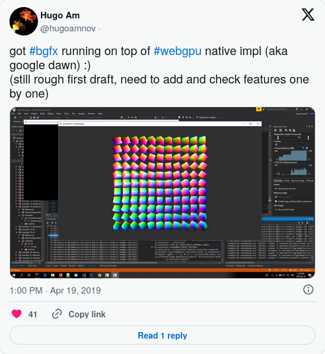
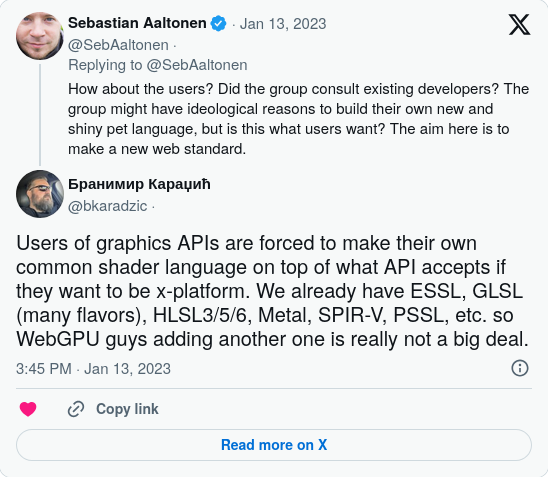

## Introduction

What is bgfx? bgfx is cross-platform / API agnostic - render anywhere, effortlessly - rendering library. It [occupies space just like WebGPU native](https://web.archive.org/web/20200503173204/https://kvark.github.io/web/gpu/native/2020/05/03/point-of-webgpu-native.html), ANGLE or similar rendering libraries that provide cross-platform rendering. The key difference: bgfx is a mid-level library. Its core concept is a declarative API with draw call ordering via "views" - generalized rendering buckets where users define the purpose and order. It's higher-level than the backends it implements, yet not so high-level as to dictate concepts like pipelines, meshes, cameras, lights, or materials.

## First take!

bgfx got WebGPU backend implementation committed in the main repo in May of 2020. We could say bgfx was an early adopter of this technology. The original implementation was done by [Hugo Amnov](https://github.com/hugoam) in this [PR](https://github.com/bkaradzic/bgfx/pull/2132).

Hugo has been working on WebGPU for bgfx since early 2019.

<!--  -->


By early 2020 he had bunch of examples working:

<!--  -->


At that time it looked like WebGPU was about to be released within a year. WebGPU was in development for at least [3-4 years](https://en.wikipedia.org/wiki/WebGPU#History), and to me that seems enough time from the initial proposal to release in all major browsers. Oh boy, I was wrong with estimating how long it would take... 😂

This was done pre-WGSL, and implementation used SPIR-V for shaders. The backend implementation used C++ headers. Implementation lacked some features but covered many examples in both native and browser. Over time, work on the backend ceased, and code was just waiting for some news about WebGPU progress, which was slow. After a longer period of inactivity, I [removed](https://github.com/bkaradzic/bgfx/pull/3198) this implementation in November 2023 with the following justification:

> - WebGPU not being ready in all browsers as of 11/2023.
> - Code rot of code in bgfx due lack of maintainer (code not touched in 2+ years).
> - Even if code is updated, there is no clear path from shaderc GLSL to WGSL.

## Second take!

In early November 2025, I had some private conversations about WebGPU, and I was curious about the current state of Tint. It's been 2 years since the first bgfx WebGPU implementation was removed, and I already had a feeling that it might be a good time to reconsider it.

<!--  -->


I got the latest Dawn and started looking through the Tint code and pretty quickly realized there was a [`tint::SpirvToWgsl`](https://github.com/google/dawn/blob/1beef0ee5577452926638b99181dc20e2ab611d6/src/tint/api/tint.h#L50-L51) library function. The next step was to try to hook up bgfx's shaderc and spit out WGSL. It all went pretty smoothly, at which point I realized that some of the issues we had with the original implementation might not be issues anymore, and it might be a good time to start adding back the WebGPU backend. I started immediately stripping Tint to the minimum needed for bgfx's shaderc to use this SPIR-V to WGSL translation. And the end result is a shader compiler Frankenstein: bgfx's flavor of GLSL -> preprocessor + patching -> HLSL -> GLSLang -> SPIR-Cross -> Tint -> WGSL. I already had a new implementation of WebGPU up and running when the good news ["WebGPU is now supported in major browsers"](https://web.archive.org/web/20251125184144/https://web.dev/blog/webgpu-supported-major-browsers) came out.

Unlike the first take WebGPU backend, I choose to use C instead of C++ headers. I find C headers generally simpler and cleaner. When I start writing each backend, I usually base it off of some existing backend. With WebGPU I based it off of D3D12, but during development I realized D3D11 or Metal might be a better choice. Even though some people compare WebGPU with Vulkan, I would put it closer to Metal and D3D11 or D3D12 than Vulkan. Similarities with Vulkan probably come from some basic Instance/Device initialization details or the way structure extensions are chained.

### WGSL (WebGPU Shading Language)

WGSL has drawn considerable criticism over time, but personally, I only dislike its syntax-everything else seems reasonable. Text as an intermediate representation (IR) is perfectly fine, and I fully agree with this statement from the conclusion of the [Horrors of SPIR-V](https://web.archive.org/web/20210520210926/https://kvark.github.io/spirv/2021/05/01/spirv-horrors.html#:~:text=SPIR-V%20is%20probably%20a%20good,of%20your%20shaders) article justifying WGSL:

> SPIR-V is probably a good format for what it was made for: driver compilers. It’s not as good for the intermediate portable representations of your shaders.

“Another shading language” argument against WGSL is also quite a weak argument, since there is no common agreement on shading language. HLSL actually is becoming the de facto standard thanks to the [glslang](https://github.com/KhronosGroup/glslang) and [SPIRV-Cross](https://github.com/KhronosGroup/SPIRV-Cross) libraries. Right now, it is possible to go from HLSL to any IR.

<!--  -->


I personally think that textual IR for shaders is actually not much different than binary representation; at least it’s not pretending that it’s something that drivers can directly consume like DXBC, DXIL or SPIR-V. All IR would be parsed and recompiled by the driver. Only on video game consoles, where you can actually produce shader binary that the GPU would directly consume after minimal validation, would this textual IR cause big problems, but on PC, where parsing and recompiling happens, it’s a non-issue. One big benefit of textural IR is that shaders can be trivially generated at runtime. Projects like [glsl-optimizer](https://github.com/aras-p/glsl-optimizer?) showed that the sane way to deal with textual IR is not to pass directly user-authored shaders but rather to pass compiled shader source that had optimization passes, and represent the minimum code required for the shader.

### What WebGPU got wrong

 - Versioning header files: There are 4 different webgpu.h headers. wgpu-native is using a webgpu.h from 2 years ago. Dawn is using 2 different ones: one is generated with the latest, and there is one in the 3rdparty directory from 7 months ago. Emscripten, depending on the version, has a few years' old header, and the latest doesn’t have any. However, there is another version of Emscripten in Dawn... It's really chaotic without any way to programmatically detect which one is which. As of now, bgfx is locked to the Dawn implementation, native only, and it’s not possible to use wgpu-native, nor the official Emscripten release. I plan to address this in the future, but I'm hoping that at some point they will just align to a common subset, so that I don’t have to do ifdefery based on which implementation is targeted.

 - Texture format chaos: [Tier1](https://www.w3.org/TR/webgpu/#texture-formats-tier1), [Tier2](https://www.w3.org/TR/webgpu/#texture-formats-tier2), [RG10B10UfloatRenderable](https://www.w3.org/TR/webgpu/#rg11b10ufloat-renderable), [Depth3DFStencil8](https://www.w3.org/TR/webgpu/#depth32float-stencil8), etc. Then you have to read specs to understand what formats can do what with each "feature." It would be better, even if we have to request these formats on device creation, if there is an API call that spits out a table of what formats are supported and what the format capabilities are so that we can do this programmatically instead of reading specs. This is like the worst idea from OpenGL texture extension hell.

 - W3C also picked the worst extension method of chaining structures introduced by Vulkan. This forces all structures to have `.nextInChain` at the beginning of the struct. From my POV, this approach is majorly flawed. Foremost, not everything will be extended, and we might see cases where it's never used, or for those things that do get many revisions, where the original struct is just there to provide `.nextInChain` pointer. Second, it's not obvious from the header file what can be chained where, and parsing specs/docs is required to understand the relationship. Direct3D's COM deals with this in a much better way with versioning structs, and providing extension methods for each version while providing backward compatibility by keeping previous version functionality.

 - The API has reference counting, but no way to inspect the current count via API. This wouldn't be bad if at least at shutdown we got a validation error if there are still some references alive with a hint which ones are leaking.

 - There are some APIs that are overkill in terms of the variable size they take. For example, `WGPUColor` is using doubles for RGB values. Then `size_t` appears in a lot of APIs where the maximum value is way below the `size_t` limit; even an 8-bit or 16-bit value would be sufficient.

 - Not providing a way to clear the framebuffer that respects viewport and scissor settings, you only get functionality to clear the whole framebuffer. While this is obviously good enough for most cases, it's really annoying when you need to do a partial clear, and suddenly you have to add more shaders to your app just to do the clear. bgfx deals with this anyway, since different backends require it, but W3C should at least just add the equivalent of `ClearRenderTargetView` from D3D12.

 - In some cases, mapping too much 1:1 WebGPU to the underlying API. For example, `wgpuRenderPassEncoderDrawIndirect` and `wgpuRenderPassEncoderDrawIndexedIndirect` are mapped to exactly the arguments D3D11 would expect. But the addition of two more arguments, indirect call stride, and number of indirect calls inside buffer, would save on validation on multiple calls when there is more than one indirect call in the indirect buffer.

### What WebGPU got right

 - Simplified buffer and texture management API. WebGPU has the simplest way to deal with textures and buffers, to the point that, for example, [`bgfx::blit`](https://bkaradzic.github.io/bgfx/bgfx.html#blit) maps almost 1:1 to WebGPU's implementation of copy between textures. The only annoying thing about texture API structures is the `WGPUTextureAspect` field that has some niche use case, but it's omnipresent in all structs dealing with texture.

 - Use of WGPUStringView, and `.labels` by default everywhere, helping debuggability.

 - Validation. While in some cases it's too strict, overall it's a great help when developing for WebGPU from scratch. If you use `webgpu_native.dll` built with debug info, you can set the `DAWN_DEBUG_BREAK_ON_ERROR` environment variable, which will break on the exact validation problem you are experiencing, and you will be able to fix any issue without guessing.

   In some cases, validation is complaining about a specific setting while there are not multiple alternatives, and WebGPU could just internally make the correct fix. Examples of this are filterable/non-filterable texture formats, where the sampler must be set at point/nearest sampling, and the sampler type must be set to NonFilteringFloat. So the user has to track this in three different locations even though setting the texture format at one place would be sufficient for WebGPU to do the right thing.

   The other thing on top of my head is blend mode. Once you set the blend equation to min or max, both srcFactor and dstFactor must be `one` or `undefined` to pass validation. Really, who cares what's there if `undefined` is an acceptable setting?!

   API validation is generally good, especially when resource names are provided by the user. There are only a few cases where validation messages are useless, for example:

   `[Invalid Command Buffer] is invalid. - While calling [Queue].Submit([[Invalid CommandBuffer]])`

   `The shader's texture sample type (TextureSampleType::Depth) isn't compatible with the layout's texture sample type (TextureSampleType::Float) (it is only compatible with TextureSampleType::Float for the shader texture sample type).`

### Dawn & Tint Bugs

There are a few bugs I discovered while working with Dawn:

 - Tint fails to translate SPIR-V that uses RG8 and R16F image formats in compute shaders.  
   https://issues.chromium.org/issues/471177483

 - WGPUFeatureName_R8UnormStorage is not working as expected, and requires enabling ChromiumInternalGraphite feature.  
   https://issues.chromium.org/issues/471492268

 - DrawIndirect validation is making assuptions about indirecBufferOffset and breaks draw indirect draw calls.  
   https://issues.chromium.org/issues/472821119

   This was totally my fault. I didn't realize I have to turn on `WGPUFeatureName_IndirectFirstInstance` if the compute shader is using anything other than 0 for the `firstInstance` argument of indirect draw that's written into indirect buffer.

 - FXC failure "error X3511: unable to unroll loop"  
   https://issues.chromium.org/issues/474763965

Dawn on macOS occasionally fails to render one of the passes (usually ImGui). I haven't identified the cause, but since it doesn't occur on Windows or Linux, no validation errors are thrown, and it looks correct when the pass doesn't disappear-with no differences in bgfx's WebGPU backend code, I suspect it's a Dawn issue but need to investigate some more before submitting the issue.

### Building Dawn Native

bgfx repo doesn't have Dawn native shared libraries, so user needs to build them if they wish to use WebGPU backend. Building is quite straight forward.

    git clone https://dawn.googlesource.com/dawn
    cd dawn
    python tools/fetch_dawn_dependencies.py

    cd build
    cmake -DDAWN_BUILD_MONOLITHIC_LIBRARY=SHARED -DCMAKE_BUILD_TYPE=Release ..

Then depending on platform invoke `make` on Linux and macOS or open `dawn.slnx` file in VS on Windows.

After the build shared library is located in

    build/src/dawn/native/libwebgpu_dawn.*

Copy file to bgfx/examples/runtime directory. On Linux set `LD_LIBRARY_PATH=.` enviroment variable.

Or follow steps "Without depot_tools" here:  
https://github.com/google/dawn/blob/main/docs/building.md#without-depot_tools

## Conclusion

While bgfx already supports the platforms and graphics APIs that native WebGPU targets, integrating WebGPU offers the obvious benefit of compatibility with the modern browser GPU API. Less apparent advantages include long-term support from major companies like Google, much like OpenGL ES via ANGLE is ubiquitous, WebGPU via Dawn and gfx-rs should endure for years. Just as WebGL dominated cross-platform graphics for the past 15 years, I anticipate WebGPU claiming that role for the next 15 years. It wouldn't surprise me if native WebGPU emerges at the driver level, at least on Linux. This aids long-shelf-life applications and games built with bgfx: developers could eventually drop native backends and rely solely on WebGPU to span multiple OS generations without retesting graphics code across APIs. Another subtle benefit is establishing WebGPU as bgfx's new minimum-spec renderer, enabling compute shaders everywhere. For aspiring graphics programmers, WebGPU serves as a solid alternative to the classic "Learn OpenGL" path, offering a gentle browser-based environment for initial steps before transitioning to native development.

As of this writing in January 2026, WebGPU isn't quite ready yet. While all major browsers support it, lingering issues remain with inconsistent implementations, building for different targets, and more. I expect these to resolve within the year. 🤞

Some might think bgfx is not needed with native WebGPU available. In the 13+ years of bgfx's existence as open source, I've seen such comments repeatedly; they arise with each new API promising effortless cross-platform magic, from ANGLE to Vulkan and now WebGPU. Yet bgfx endures because these "standardized" APIs often fall short: not truly cross-platform, too rigid in standards that ignore platform-specific performance, bulky and hard to port to NDA platforms, inflexible with emerging APIs, and more. Ultimately, bgfx's core strength is its higher-level graphics library, providing a far simpler API than most low-level alternatives.
