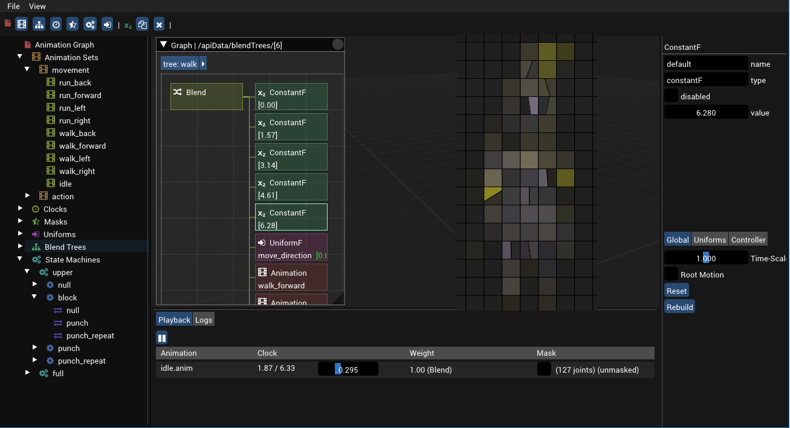
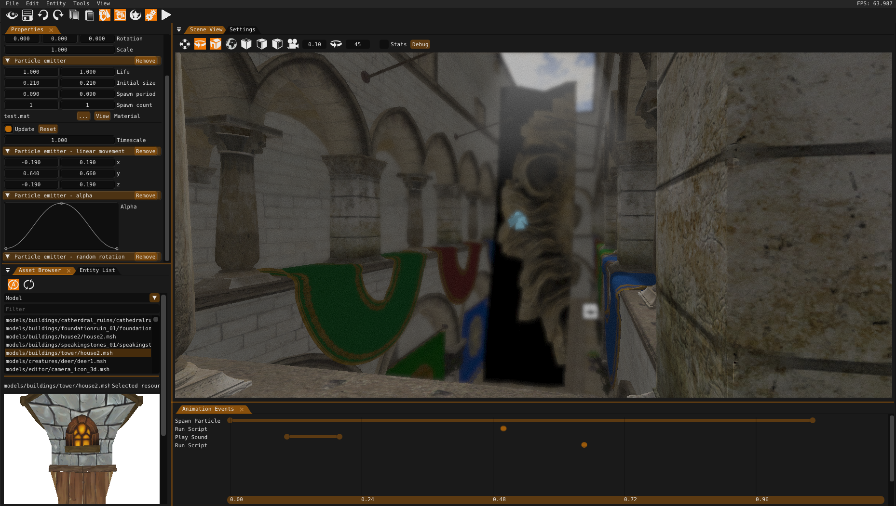
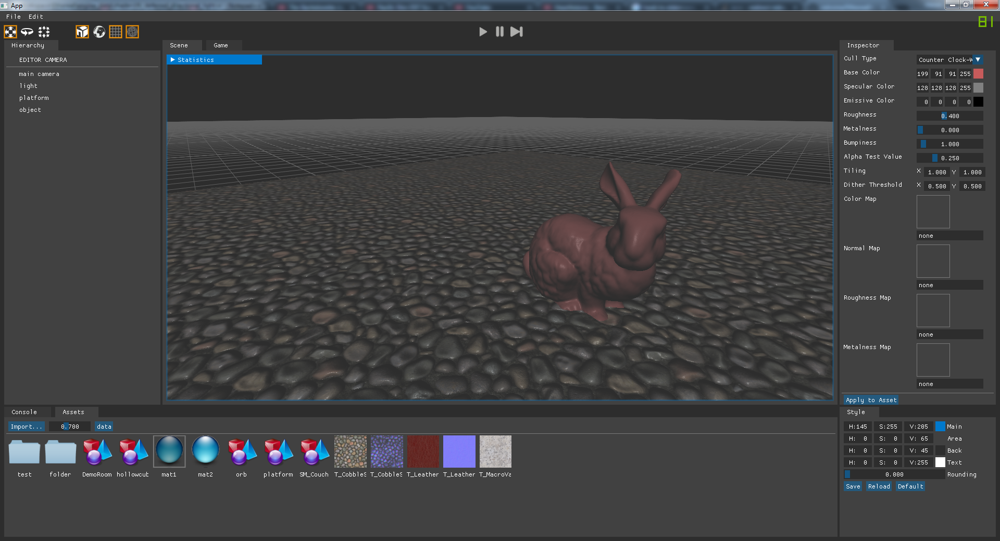
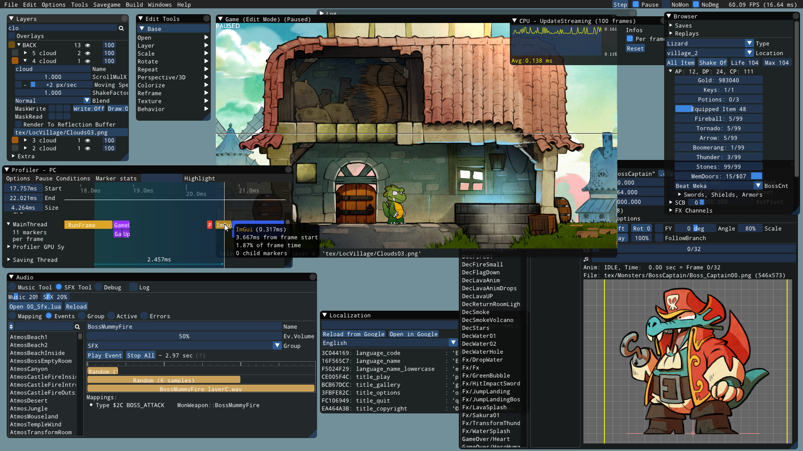
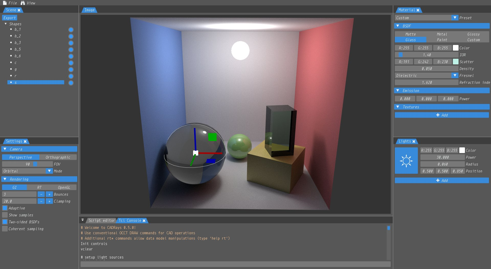
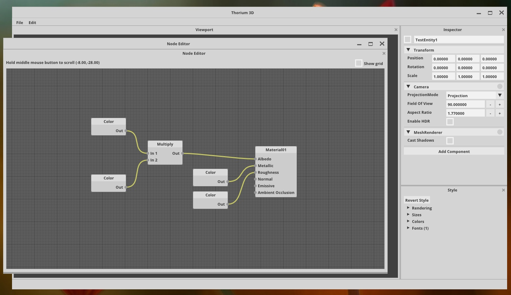

This article was originally published as a gist [here](https://gist.github.com/bkaradzic/853fd21a15542e0ec96f7268150f1b62).

## Prerequisites

Before you continue, if you don't know what IMGUI is don't bother reading this post, just ignore it, don't write anything in comments section, etc. If you're curious about IMGUI see [bottom](https://gist.github.com/bkaradzic/853fd21a15542e0ec96f7268150f1b62#extra) of this post, otherwise continue whatever you were doing, this post it's not for you. Thanks!

If you know what IMGUI is, for context read following presentations and blog posts:

 - Insomniac’s Web Tools Postmortem  
   https://web.archive.org/web/20170501000000/https://deplinenoise.wordpress.com/2017/03/03/slides-insomniacs-web-tools-postmortem/

 - Why Qt and not IMGUI?  
   https://web.archive.org/web/20170317000640/https://deplinenoise.wordpress.com/2017/03/05/why-qt-and-not-imgui/

 - Web Tools for Application UI  
   https://web.archive.org/web/20210124071004/https://stoyannk.wordpress.com/2017/03/03/web-tools-for-application-ui/

The last link is not related to anything below but it's part of discussion above, putting it here just for people who are interested to see all opinions.

## Disclaimers

 - I used extensively Qt in the past, I consider it to be one of the best designed C++ project, their documentation is amazing, there is huge community, etc. There is really nothing I dislike about it (not even moc'ing). All my experience with Qt is pre-version 5.0, but I don't think much changed about C++ side since they were focused to mobile and declarative UI side of things.

 - This post is not direct answer to Andreas, nor critique of their decision to use Qt, just my opinion why I think IMGUI is more suitable for GameDev tools.

 - When I say Qt below, I mean any traditional GUI library, like wxWidgets, WPF, etc.

 - When I say IMGUI, I mean [dear-imgui](https://github.com/ocornut/imgui) since it's most popular one, but it could apply to any IMGUI library.

 - This is post only about **tools UI**, not game UI. I don't think those should be unified since constraints and requirements are completely different. I'm gonna keep writing **tools UI** in bold, because there will be always someone to ask what about game UI (it's **NOT** part of consideration here).

 - For gullible: Unity is doing it, they all the rage now, they make $$$, obviously you can attribute all of their success to decision to use IMGUI, End Of Discussion. See docs here: https://docs.unity3d.com/Manual/GUIScriptingGuide.html :)

## Introduction

I never used Web Browser for building tools. I was curious when Insomniac announced their switch to web tech for tools. But Java Script always looked jenky to me for anything serious. To be honest, I think this about any interpreted code. ;) At the time I was hopping Native Client (NaCl) would take of and it would be fine to write tools in C++ and run them inside Web Browser. I shipped one game for NaCl, and that worked pretty well, but NaCl didn't really take of. Their postmortem explains in details why using web tech is bad if you only have C++ programmers working on it.

I used IMGUI style widgets for a long time. Most of use cases were for debugging or tweaking parameters in simple examples. Before I never considered it seriously for GameDev tools like world editor. When using Qt and similar frameworks there is a lot of utilities that come with it, but are unrelated to GUI widgets itself. IMGUIs traditionally don't have that part, and represent only widgets itself. For example, by just using Qt framework you get [QDir](https://doc.qt.io/qt-4.8/qdir.html) or [QFileInfo](https://doc.qt.io/qt-4.8/qfileinfo.html) out of box. With IMGUI there is nothing like that, which usually mean you need to write your own, and it causes huge slow down early on.

Most of GameDev companies pick existing framework like Qt, WPF, etc. because they can get programmers productive ASAP, they don't need to ship tools on platforms other than Windows (which in case of Qt is not a problem, but it is in case of WPF). The reason why Unity didn't go this route is **probably** (guessing here) because at the time Qt wasn't licensed under LGPL (it was dual GPL / commercial license with $2K fee per programmer seat), and there wasn't any other viable cross platform solution for GUI, and they wanted to support OSX & Windows. Considering this, and ignoring Unity's case, it's pretty obvious route to choose existing framework from productivity point of view of manager or producer.

## That all sounds good, what's wrong with it?

What is not obvious frameworks usually come with extra knowledge requirements of knowing how to use them, which makes person that knows it efficient, and person that doesn't know it very inefficient. People usually trivialize this with C# in the same way as they do with JavaScript, like everyone knows it, documentation is everywhere, etc. But that's not true, and C# requires people who spent enough time with to know it well. Just it appears that way because land mines in C# like in JavaScript are harder to trigger unlike in C++. Even if early on team is not split into two groups of those that know framework and those that don't, editor and engine teams, eventually there will be clear who knows more UI framework, and who knows more engine side... Which leads to another problem, person that knows the most about the system is not making the editor for it. In many cases this might not be huge issue, but it becomes major bottleneck for tools that require domain specific knowledge. When it comes to team, ideally whoever writes engine feature is also responsible for editor side of things, integration with world editor, user facing features, etc. Editor team with IMGUI could be much smaller and someone who provides editor infrastructure, undo-redo, load/save, docking, etc. not someone who writes specific editors.

If you used any framework before, and if you look pages 56-65 from Insomniac's [slide deck](https://deplinenoise.files.wordpress.com/2017/03/webtoolspostmortem.pdf#page=56), you'll realize that not many of those widgets are possible out of box. Most of them are custom widgets, or views of data that's also very engine specific. Custom widgets in Qt get really complicated pretty quick. If data is tree/list you could use QTreeView create delegates hook signals, etc. But when it gets really complicated you have to render it as QScrollArea or QPixmap. This is actually part where IMGUI is the strongest and why I feel it's ideal for writing GameDev tools. Code for custom widgets in IMGUI has hardware acceleration, you're not drawing pixel-by-pixel and blitting. Code for doing this with IMGUI is much more simple, and familiar to anyone working on the game. Just to illustrate this, here are hex editor widgets written in Qt [qhexedit2](https://github.com/Simsys/qhexedit2), [QHexEdit](https://github.com/Dax89/QHexEdit), there are million of these hex editors written in Qt you can search it. Then use that Qt code and compare it with hex editor written with dear-imgui https://gist.github.com/ocornut/0673e37e54aff644298b. Simpler? IMGUI widgets are highly interactive, everything can be updated every frame, with traditional UI framework this could be huge performance penalty since it's more traditional static UI solution.

Frameworks in general mean you don't embed framework to your engine, you embed your engine to theirs framework. Which complicates a lot of things, since engine is also framework itself. There are workarounds, grabbing window handle using it from other process, or using shared memory, or any other way of IPC, etc. But with IMGUI it's already in your engine, no need to figure out how to interop between renderer that your engine is using and framework's rendering API is using underneath.

Large frameworks have tendency that require large teams to support them. I lost count how many times Qt changed owner in last 10 years (Trolltech, Nokia, Digia, a few more?). Every time this happens you have to worry what new owner might do with it. You wonder is it going to be supported? Are they going to drop classic desktop widgets support and focus only on QtQuick in 2-3 years from now? With framework like WPF is the same, MS could just quietly stop working after some massive layoff and let it decay unsupported. MS is also famous for this hype-hype-then-abandon cycle for their frameworks (XNA, Silverlight, and others). Even if both companies drop everything on GitHub with permissive license on it, both code bases are massive and require huge investment to keep maintaining it and moving forward. IMGUI is simple enough that even small GameDev team could take control over it in case that original author decides they are done with it.

## What IMGUI lacks?

As I said above utilities that come from frameworks are really huge boost in beginning. Nowadays is possible to use Qt's core library without the rest of Qt, so that might be good pick for anyone who doesn't have good base cross platform library.

All IMGUI libraries, that I know of, don't have well developed system for users to contribute their extensions to library. In Qt you could write very complex widgets, share it, without needing to change library or that Qt code knows anything about extension. The most popular IMGUI library dear-imgui has way to submit link to repo that contains extensions, new widgets, etc. but usually code doesn't conform to dear-imgui's standard, dependencies users choose are sometimes insane, and overall it's not easy way to integrate extensions with existing code. Or simply some people don't even choose to contribute anything back, because there is no easy obvious way to do it. This all could be solved with some more structured way of contributing to dear-imgui extensions.

IMGUI power usage is not good for mobile devices since it redraws whole screen all the time, that might be a problem and it could be solved, but we're talking here about GameDev **tools UI**, and my assumption is that GameDev tools are run on desktop PC.

IMGUI doesn't have native internationalization support, but your game should have that anyway, so you could use that system instead relying on frameworks for localization for tools and your own for game. Also if you're doing only internal company **tools UI** it's feasible to completely ignore localization, and just use the most common language company employees are using.

Examples
--------

Here are few screenshots of GameDev tools made with IMGUI:

See other IMGUI screenshots here:  
https://github.com/ocornut/imgui/issues/123  
https://github.com/ocornut/imgui/issues/539  
https://github.com/ocornut/imgui/issues/772  
https://github.com/ocornut/imgui/issues/973  
https://github.com/ocornut/imgui/issues/1269  
https://github.com/ocornut/imgui/issues/1607  

## Summary

To summarize why I think Immediate Mode GUI is way to go for GameDev tools:
 - IMGUI is great for writing custom controls which are majority of controls you need anyway, but it comes with basic controls that big frameworks offer too.
 - IMGUI doesn't require domain specific knowledge of framework and it makes every programmer effective creating editors and tools to support their engine features. 
 - IMGUI is simple enough that in case of abandonment by original author can be taken over trivially even by small team.

My prediction is that in a few years Insomniac's tools team will come up with another GDC postmortem explaining what's wrong with Qt, and why they switched from Qt to IMGUI. I'm just joking here, but you never know... :)

## Extra

 - Immediate-Mode Graphical User Interfaces  
   https://web.archive.org/web/20190130051359/https://caseymuratori.com/blog_0001

 - IMGUI tutorial  
   https://web.archive.org/web/20190130051340/http://sol.gfxile.net/imgui/

 - Author of LumixEngine lists pros/cons after switching from Qt to IMGUI:  
   https://github.com/ocornut/imgui/issues/123#issuecomment-142700775

 - One Draw Call UI  
   https://web.archive.org/web/20190130051421/https://ourmachinery.com/post/one-draw-call-ui/
 
 - Rethinking UI APIs  
   https://web.archive.org/web/20190130051320/https://games.greggman.com/game/rethinking-ui-apis/
  
 - Announcement of Graphite (research platform for computer graphics, 3D modeling and numerical geometry) switching from Qt to IMGUI  
   https://twitter.com/BrunoLevy01/status/956653527597764611

 - Could ImGUI be the future of GUIs?  
   https://web.archive.org/web/20190130051241/https://games.greggman.com/game/imgui-future/

 - Micha Mettke - internal immediate mode UI game engine editor  
   https://twitter.com/MichaMettke/status/1235213089026576384

   > Some advantages were instant onboarding of team into UI programming and 1/3 in code size compared to old Qt code.

 - GDC 2020 - Writing Tools Faster - Niklas Gray  
   https://web.archive.org/web/20200317004259/https://ourmachinery.com/writing-tools-faster.html
